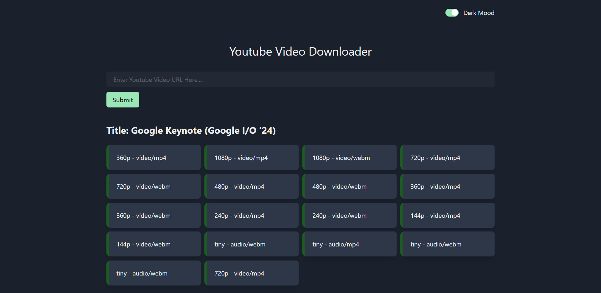

# Youtube Video Downloader

This web application, built with React and Node.js (Express), allows users to download videos and audio files in various formats using a YouTube video link. Additionally, users can switch between different color themes to personalize their experience.



## Features

- Download videos and audio files in multiple formats from YouTube links.
- Toggle between light and dark mode for a customized look.

## Tech Stack

- **Frontend**: React
- **Backend**: Node.js (Express)

## Getting Started

### Prerequisites

Make sure you have the following installed on your system:

- Node.js
- Yarn (or npm)

### Installation

1. **Clone the repository:**

    ```sh
    git clone [https://github.com/yourusername/your-repo-name.git](https://github.com/Rafiul-Islam/Youtube-Video-Downloader.git)
    cd your-repo-name
    ```

2. **Install dependencies for both frontend and backend:**

    ```sh
    # Navigate to the server directory
    yarn install

    # Navigate to the client directory
    cd client
    yarn install
    ```

### Running the Application

1. **Start the backend server:**

    ```sh
    # In the server directory
    node index.js
    ```

2. **Start the frontend development server:**

    ```sh
    # In the client directory
    yarn dev
    ```

3. Open your browser and navigate to `http://localhost:5173` to see the application running.
